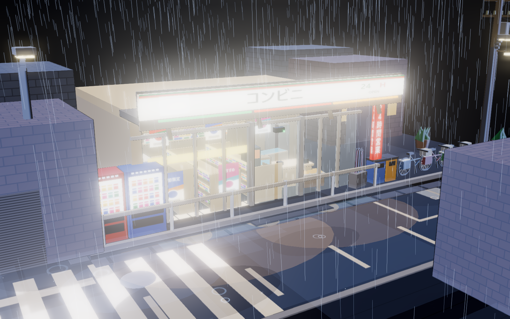
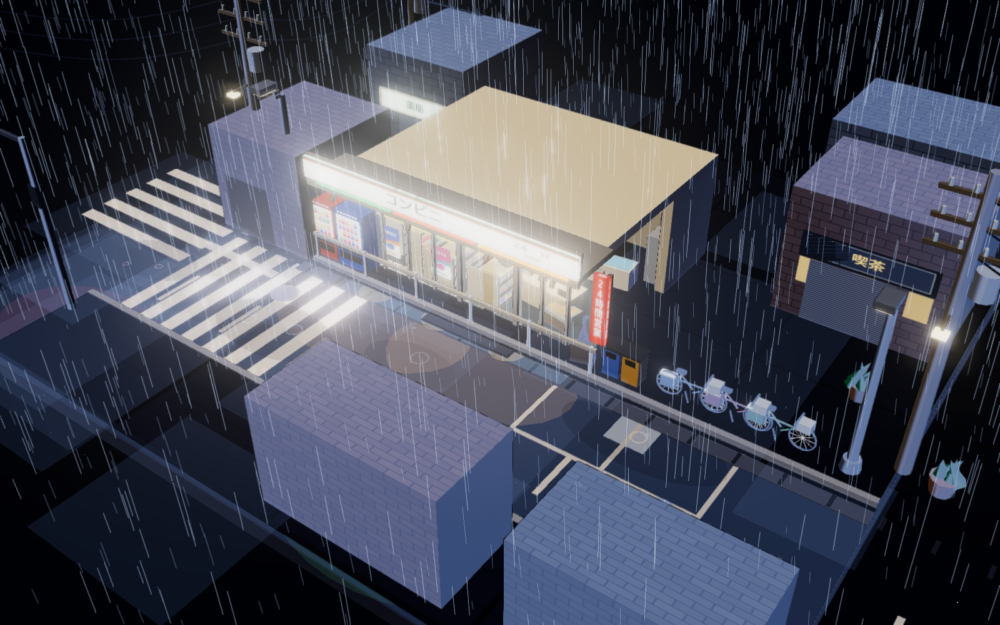
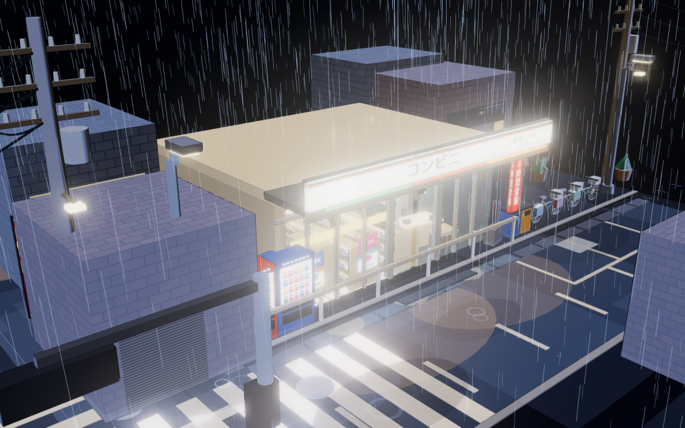
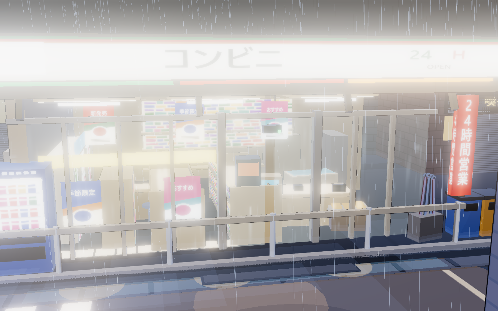

# 雨の夜のコンビニ街角 — Rainy Night Convenience-Store Corner

A **三渲二 (cel-shaded 3D-to-2D)** miniature diorama of a Japanese convenience-store
street corner on a wet night, rendered live in WebGL.

## Deliverable

| File | What it is |
|---|---|
| `index.html` | **The deliverable.** One self-contained file (737 KB). Open it in any modern browser. No server, no network, no dependencies. |
| `preview/` | Reference stills rendered from the live scene (see below). |
| `_build/` | Source + build pipeline. Not needed to view the scene. |

### Viewing

Open `index.html` directly (`file://` works). **Drag** to orbit, **wheel** to zoom,
**right-drag** to pan. There is no UI — the canvas fills the window.

A `?pose=x,y,z,tx,ty,tz` query parameter overrides the camera; that is how the
preview stills were captured.

## What is in the scene

**The store (visual centre).** Illuminated tri-stripe fascia reading 「コンビニ」
with a `24H / OPEN` badge; a full glass frontage broken by slim mullions; a
recessed entrance bay with twin sliding auto-doors and a motion sensor; a deep
canopy with under-lighting and a warm pool spilling onto the wet pavement; a
protruding vertical 「24時間営業」 pylon sign.

**A genuinely furnished interior**, legible through the glazing: two double-sided
shelf gondolas stocked on both aisles, a tall glowing drinks-fridge bank, the
back-wall bento/onigiri/snack shelves, a checkout counter with POS terminal,
card reader and customer display, a coffee machine, a stainless oden (関東煮)
counter with lit compartments, a magazine rack, an eat-in counter with stools,
an ice-cream case, a 「後場」 back-room door with an emergency exit lamp,
hanging promo banners, glass-taped posters, floor guidance decals, a wall clock
and an indoor AC unit — all under warm ceiling light panels.

**Street and props.** Vending machines, mamachari bicycles, an umbrella stand
full of umbrellas, sorted bins, street lamps, utility poles with transformers
and drooping catenary wires, a road-name plate (桜木町 2-14), guardrail, parking
bay with wheel stops, gutter gratings and manholes, tactile paving (点字ブロック),
a notice/poster board, potted plants, a crate stack, AC outdoor units, an alley
mouth with warm spill, and neon vertical signboards (居酒屋 / 喫茶 / ラーメン) with
red lanterns on the neighbouring blocks.

**Geometry.** One square base plate (21 × 21 units) carrying a raised kerb with
a proper street corner — a main road with a zebra crossing, a side street, dashed
centre line, stop line, and drainage.

## Motion

Continuous rain in two depth layers with wind shear, plus ground splash motes;
roof-edge drips with expanding splash rings; puddle ripple rings; rain streaking
down the storefront glass; the auto-door cycling open/hold/close; an unreliable
fluorescent flicker on the fascia and pylon sign; a traffic signal running a
red → green → amber phase with a breathing pedestrian lamp; and gently pulsing
interior light.

## How it is built

I authored the shading by hand rather than using `MeshToonMaterial`, because the
look needs control over band edges, rim width and the wet-ground specular in one
pass:

* **Quantised diffuse** — half-Lambert folded into 3 bands, then mixed ~14% back
  toward smooth so the terminator stays soft rather than posterised.
* **Rim light** — a tight Fresnel term giving the crisp cel contour glow.
* **Inverted-hull outlines** — shared geometry cloned as a back-face child and
  inflated along the normal, so hundreds of parts cost almost no extra memory.
* **Wet ground** — a tight specular + Fresnel sheen, scaled well down.
* **Night grade** — shadows tinted cool blue, mild saturation, soft shoulder.
* **Analytic point lights** — a `ShaderMaterial` receives no lighting from
  three.js, so the scene's practicals are fed into the shader by hand (6 slots).

Rendering goes through `EffectComposer` with `UnrealBloomPass` for the neon and
lightboxes, `OutputPass` for tone mapping/colour space, and `FXAA`.

All textures (signage, product shelves, drink fridge, magazines, posters,
asphalt, paving, brick, shutters) are drawn procedurally to `<canvas>` at load
time with CJK font stacks — so the file has zero external assets.

## Preview

| | |
|---|---|
|  |  |
| Hero angle — the storefront | The whole model on its base plate |
|  |  |
| The street corner | Interior seen through the glass |

## Rebuilding

```sh
cd _build
node build.mjs          # writes ../index.html
node verify_layout.mjs  # asserts no geometry occludes the storefront
```

`verify_layout.mjs` and `verify_anim.mjs` are the checks used while building:
the first ray-casts from the camera to the glazing to prove no neighbouring block
occludes the interior, and the second frame-differences two captures to prove the
animation is actually live. Both are worth re-running after any layout edit —
the composition is delicate, and a block moved a metre nearer the camera will
silently bury the store.
